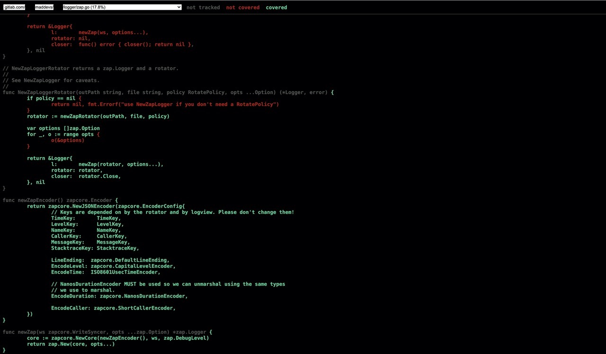

 

## What is it?
This is a simple example (currently, written in Golang) of how we can send a code coverage from GitLab CI/CD to messenger like Slack via webhook, and how to generate detailed Code Coverage reports using GitLab Pages as well.

## How it works
- At the Test stage we are running a Go test and saving output to coverage.out file. Go tool cover on this stage is for GitLab CI/CD coverage report
- coverage.out file is saved to Artifacts for next job
- At the Pages stage we are running Go tool cover for getting total coverage, then we will find Total string. Next, we will parse them with awk and get only coverage numbers. Then with the xargs and curl we send coverage percent to Slack via webhook.
- We create a .HTML file from coverage.out with Go tool cover, which generates pretty formatted HTML with coverage. After this, we create a public folder and move index.html inside. GtLab always deploys your website from a very specific folder called public in your repository. When you create a new project in GitLab, a repository becomes available automatically
- If Pages stage successfully done - you will see a new job in the CI pipeline like pages:deploy, created by GitLab
- Go to your repository GitLab Pages (https://your-url.gitlab.io/your-repo/) where you will see your detailed coverage report

## How it looks
#### Slack message

#### GitLab Pages chart

#### .HTML report

## Roadmap
- [ ] Add example in Python
- [ ] Add example in Javascript
- [ ] Add example in Ruby
- [ ] Add example in PHP

## Useful links
- [Publish Code Coverage report with GitLab Pages](https://about.gitlab.com/blog/2016/11/03/publish-code-coverage-report-with-gitlab-pages/) blogpost
- [GitLab Pages](https://docs.gitlab.com/ee/user/project/pages/index.html) documentation
- [GitLab artifacts](https://docs.gitlab.com/ee/ci/yaml/README.html#artifacts) documentation
 
## Issues:
Feel free to send pull requests. Also feel free to create issues.

## License
MIT License

Copyright (c) 2020 Mad Devs

Permission is hereby granted, free of charge, to any person obtaining a copy of this software and associated documentation files (the "Software"), to deal in the Software without restriction, including without limitation the rights to use, copy, modify, merge, publish, distribute, sublicense, and/or sell copies of the Software, and to permit persons to whom the Software is furnished to do so, subject to the following conditions:

The above copyright notice and this permission notice shall be included in all copies or substantial portions of the Software.

THE SOFTWARE IS PROVIDED "AS IS", WITHOUT WARRANTY OF ANY KIND, EXPRESS OR IMPLIED, INCLUDING BUT NOT LIMITED TO THE WARRANTIES OF MERCHANTABILITY, FITNESS FOR A PARTICULAR PURPOSE AND NONINFRINGEMENT. IN NO EVENT SHALL THE AUTHORS OR COPYRIGHT HOLDERS BE LIABLE FOR ANY CLAIM, DAMAGES OR OTHER LIABILITY, WHETHER IN AN ACTION OF CONTRACT, TORT OR OTHERWISE, ARISING FROM, OUT OF OR IN CONNECTION WITH THE SOFTWARE OR THE USE OR OTHER DEALINGS IN THE SOFTWARE.
